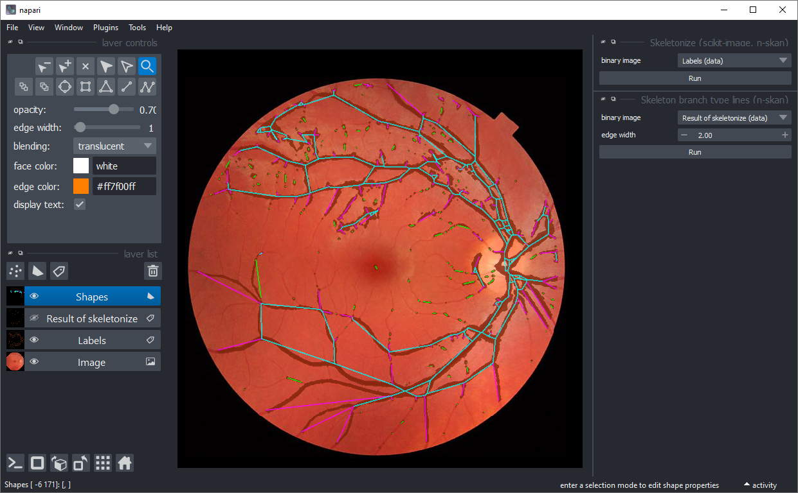

# napari-skeleton-analysis (n-skan)

Analyze skeleton images in napari using [skan](https://github.com/jni/skan)

----------------------------------

This [napari] plugin was generated with [Cookiecutter] using [@napari]'s [cookiecutter-napari-plugin] template.

## Installation

You can install 
<!--`napari-skeleton-analysis` via [pip]:

    pip install napari-skeleton-analysis

To install--> 
latest development version :

    pip install git+https://github.com/haesleinhuepf/napari-skeleton-analysis.git

## Related plugins

There are related napari plugins with similar functionality:
* [napari-skeleton-curator](https://github.com/kevinyamauchi/napari-skeleton-curator)
* [skeleton-finder](https://www.napari-hub.org/plugins/skeleton-finder)

## Contributing

Contributions are very welcome. Tests can be run with [tox], please ensure
the coverage at least stays the same before you submit a pull request.

## License

Distributed under the terms of the [BSD-3] license,
"napari-skeleton-analysis" is free and open source software

## Issues

If you encounter any problems, please [file an issue] along with a detailed description.

[napari]: https://github.com/napari/napari
[Cookiecutter]: https://github.com/audreyr/cookiecutter
[@napari]: https://github.com/napari
[MIT]: http://opensource.org/licenses/MIT
[BSD-3]: http://opensource.org/licenses/BSD-3-Clause
[GNU GPL v3.0]: http://www.gnu.org/licenses/gpl-3.0.txt
[GNU LGPL v3.0]: http://www.gnu.org/licenses/lgpl-3.0.txt
[Apache Software License 2.0]: http://www.apache.org/licenses/LICENSE-2.0
[Mozilla Public License 2.0]: https://www.mozilla.org/media/MPL/2.0/index.txt
[cookiecutter-napari-plugin]: https://github.com/napari/cookiecutter-napari-plugin

[file an issue]: https://github.com/haesleinhuepf/napari-skeleton-analysis/issues

[napari]: https://github.com/napari/napari
[tox]: https://tox.readthedocs.io/en/latest/
[pip]: https://pypi.org/project/pip/
[PyPI]: https://pypi.org/
